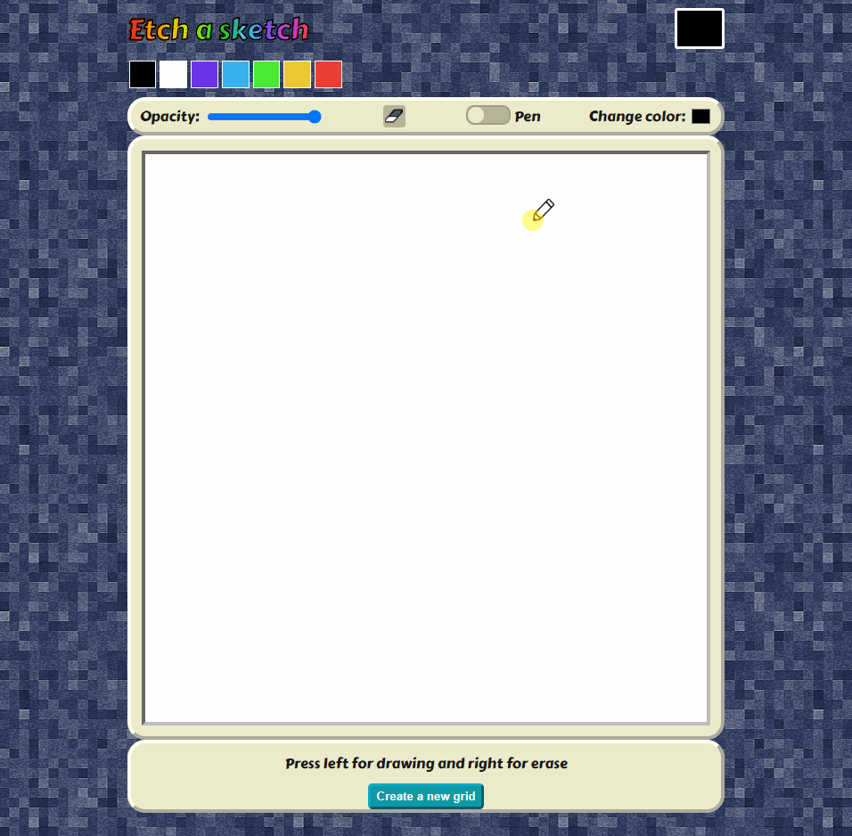
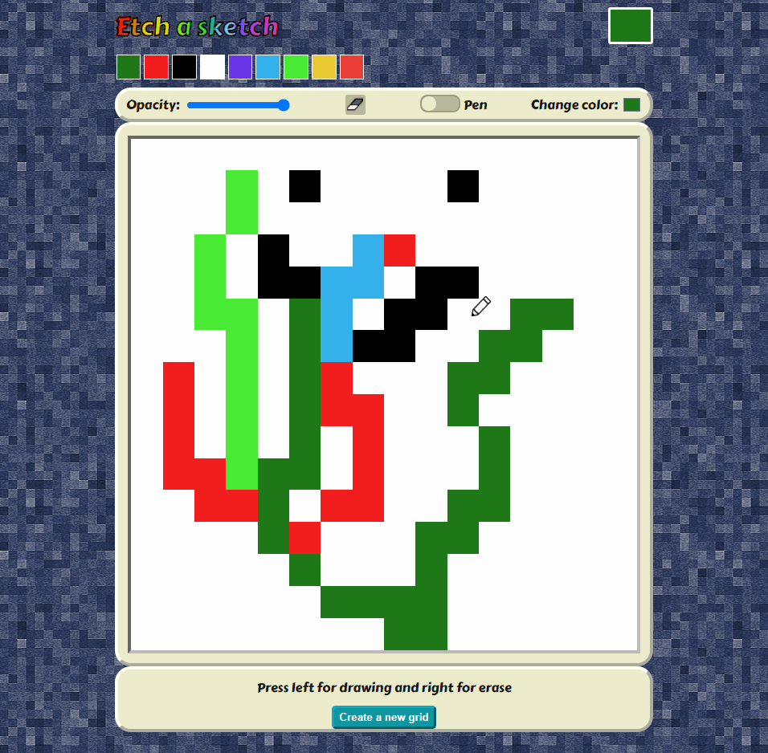
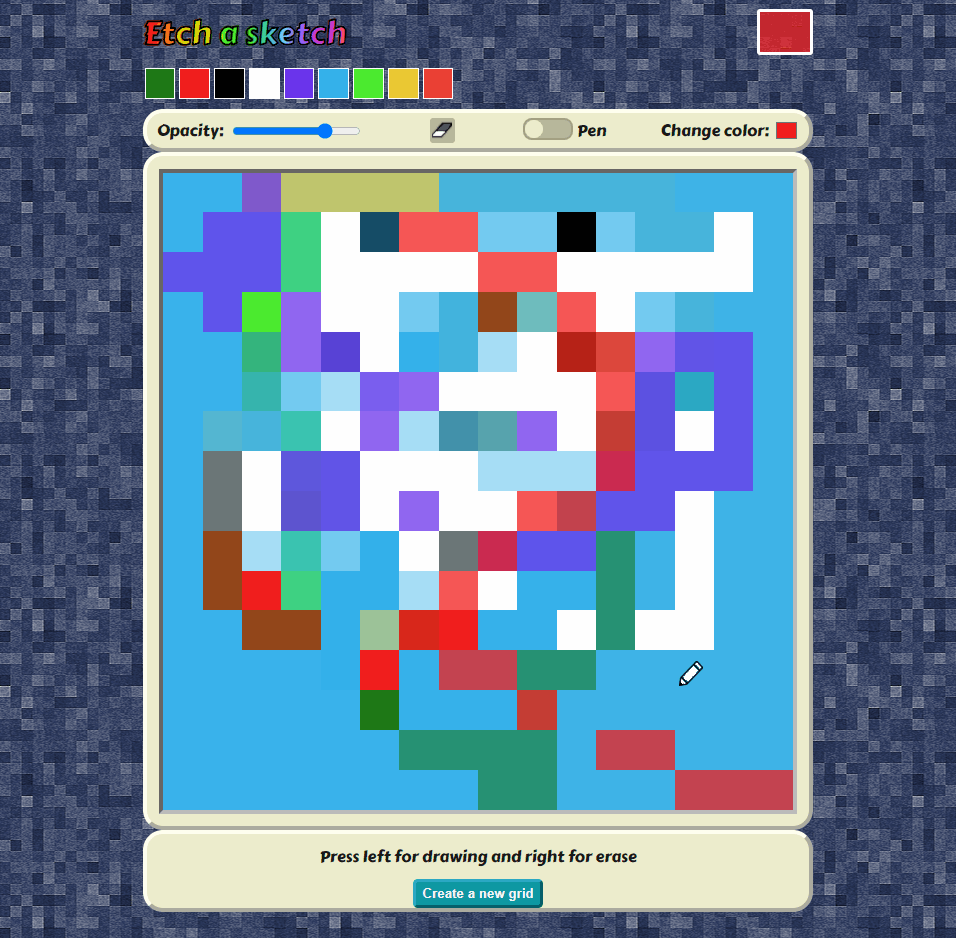

# etch-a-sketch
<h2 align="center"><a  href="https://aurelien-genois.github.io/etch-a-sketch/">Live Demo</a></h2>

## Description
The [third Odin project](https://www.theodinproject.com/paths/foundations/courses/foundations/lessons/etch-a-sketch-project) is a drawing grid without \<canvas\> (and CanvasRenderingContext2D methods) for practice basic JavaScript (Arrays, Loops, DOM manipulation, ...). I took this project to learn also how to combine colors (when changing opacity), how to change the mouse cursor and how to manage touch event (for drawing on mobile or tablet).

## Features

 

- Can draw in the grid with your mouse (pen) by holding left click or by touching with finger
- Can erase with your mouse (eraser) by holding right click
- Can choose a color from the color picker or the history palette
 
  
  

- Can change the opacity level, so the pen color is combined to the current grid cell color (additive mode)
- The opacity level is kept when changing the pen color (with the color picker or the history palette)
- Can activate fill mode with a switch checkbox
- Can fill an area of same color cells (opacity stills apply) with left click or by touching with finger
- An erase button can turn the pen/fill to an eraser (necessary for touch screens)
 
  
  

- Can create a new grid (replace the current grid)
- Can choose the grid size when create a new grid

### UX feedbacks: 
- The mouse cursor turns to a pen, an eraser or a bucket showing which mode is active
- Newly color choosed with the color picker is automatically added to the history palette
- The current pen color with current opacity is displayed in a box at the top right corner
- An abstract square-patterned background reflects the pixel art function of this project and allows the perception of the opacity level of the current color in the current color box

## Challenges
The goal of this project was initially to practice arrays, loops and DOM manipulation, I wanted to go further to learn more.

Changing the opacity of the current color was pretty simple but applying the non-opaque color on the grid was quite a challenge because it requires to convert colors from RGB format to Hex format (and vice versa) and to use additive mode to combine the color added with the current color.

The fill tool was also interesting to implement, by checking the adjacent cells color of the clicked cells and then their adjacents cells too until there is no more adjacent cells which has the same color as the clicked cell. This methods is not optimal because it has low performance when the grid is greater than 30\*30 length

The mouse cursor icon changes according to the cursor location (over the grid) and to the drawing mode (pen, fill, erase), which was fun to learn (especially the CSS cursor properties).

CSS is used also to create the switch button for changing the mode between pen and fill.

Finally I added touch events for allowing drawing on mobile/tablet. This gives me the occasion to learn touchstart, touchmove and touchend events, which will be certainly usefull for future projects.
